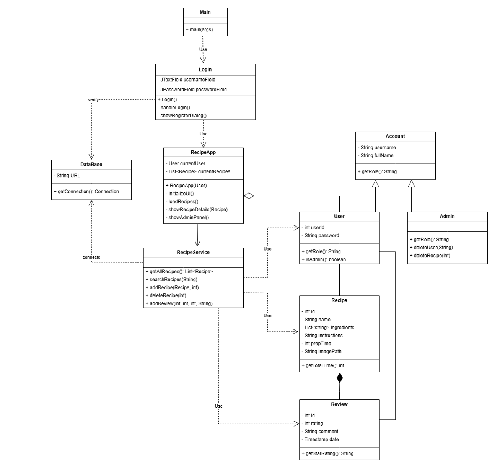
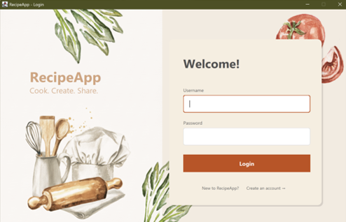
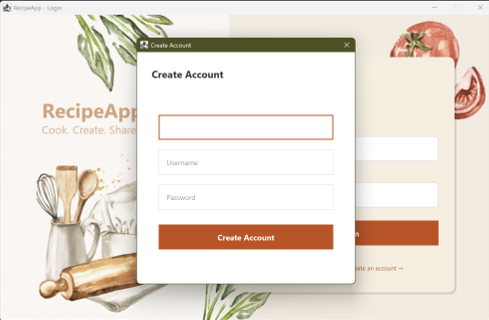
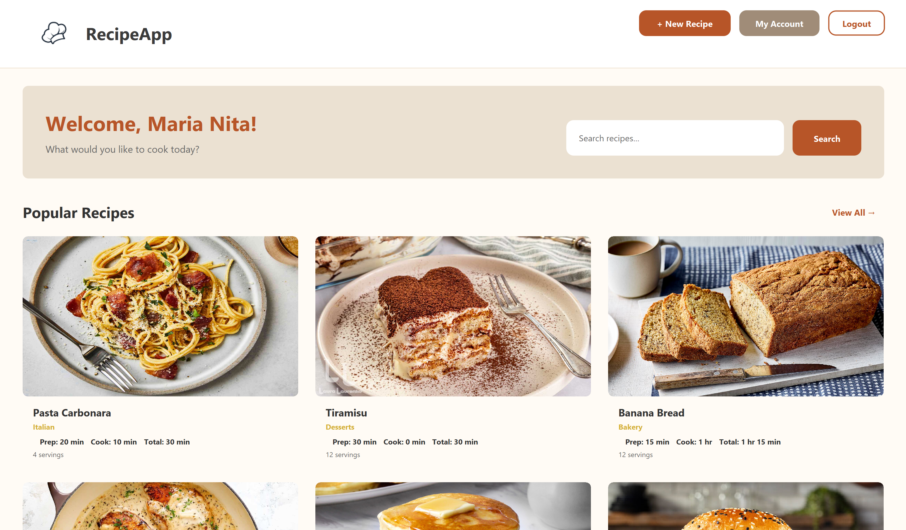
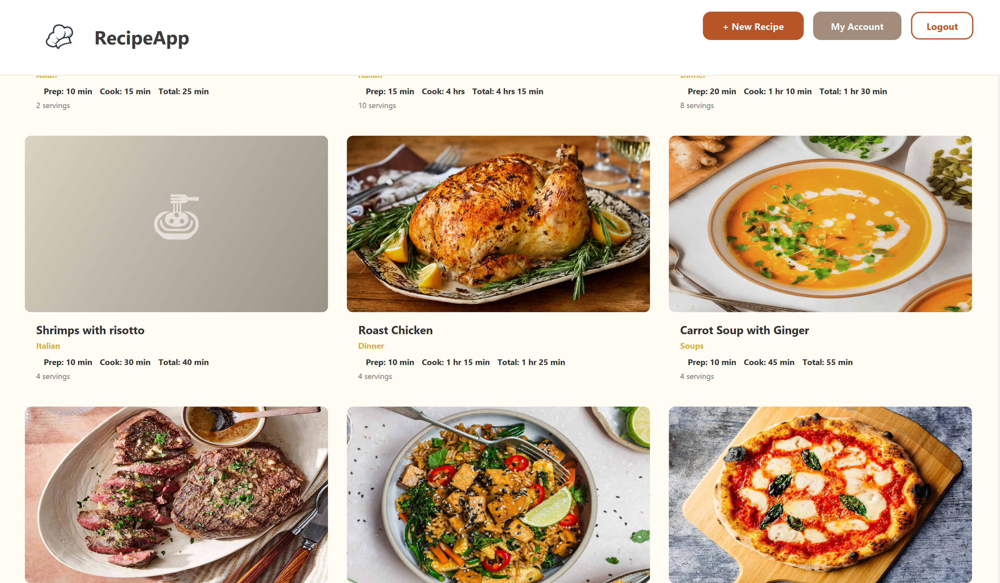
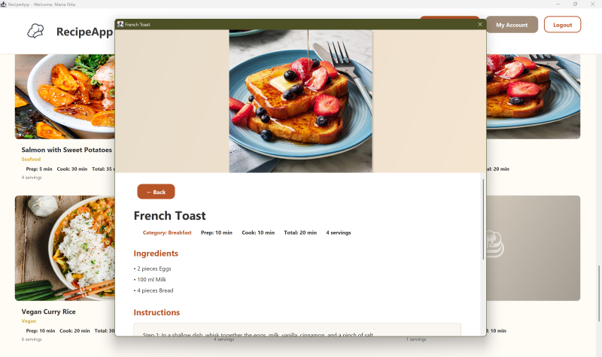
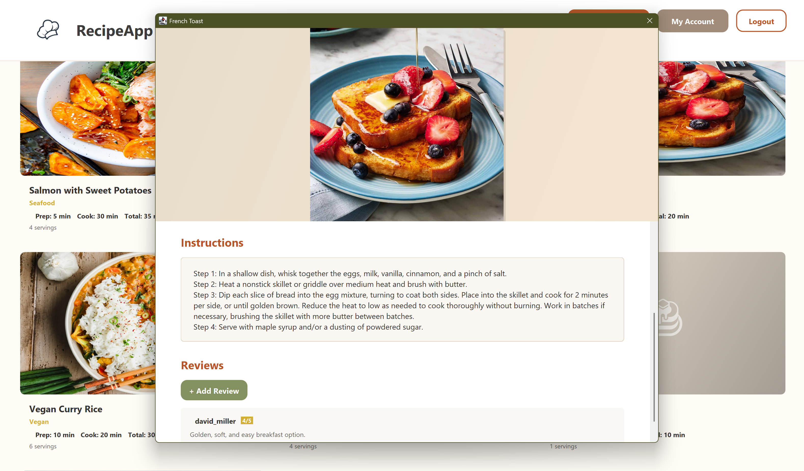
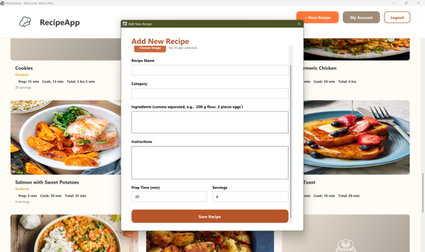
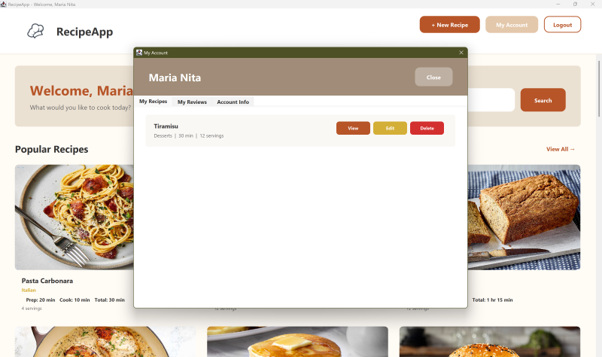
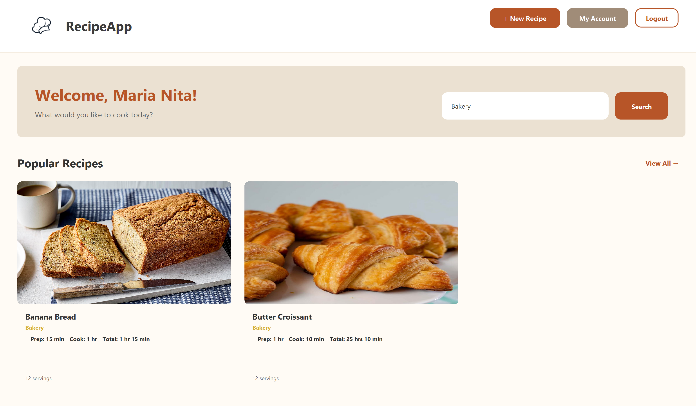

# 🍳 RecipeApp

> A Java desktop application for discovering, creating, reviewing, and managing cooking recipes.

**RecipeApp** is a desktop recipe management application built with **Java**, **Java Swing GUI**, and **Microsoft SQL Server**. The application works as a digital cookbook where users can discover recipes, create and manage their own dishes, leave reviews, and rate recipes shared by other users.

The project was developed with a strong focus on **Object-Oriented Programming (OOP)**, clean separation of responsibilities, database integration and a simple interface.

---

## 📌 Overview

Users can:

* Create and manage their accounts
* Browse available recipes
* Search recipes by name or category
* View detailed recipe information
* Create and edit their own recipes
* Add ingredients and cooking instructions
* Upload recipe photos
* Rate recipes from 1 to 5 stars
* Leave reviews and comments
* Manage their own recipes and reviews

The application also includes an **Administrator role**, allowing administrators to manage users and moderate content.

The application stores user accounts, recipes, reviews, and ingredients in a **Microsoft SQL Server database**.

---

## ✨ Key Features

### 👤 User Features

#### Authentication

* User registration
* Login functionality
* Password verification
* Role-based access between regular users and administrators

#### Recipe Discovery

* Browse available recipes
* View recipe images
* See preparation time and serving information
* Open a detailed recipe page

#### Search

Recipes can be searched by:

* Recipe name
* Category

The search functionality dynamically filters the available recipes, making it easier to find a specific dish.

#### Recipe Management

Authenticated users can:

* Create new recipes
* Add ingredients
* Add step-by-step cooking instructions
* Add photos
* Edit recipes they created

#### Reviews & Ratings

Users can interact with recipes by:

* Giving a rating from **1 to 5 stars**
* Writing comments
* Viewing reviews left by other users

#### My Account

The account section provides an overview of:

* Account information
* Recipes created by the current user
* Reviews submitted by the current user

---

### 🛡️ Administrator Features

Administrators have additional permissions for managing the platform.

The Admin Panel allows administrators to:

* View registered users
* Delete user accounts
* Remove inappropriate recipes
* Remove inappropriate reviews
* Moderate platform content

This provides a basic moderation system to keep the application organized and safe for its users.

---

# 🧠 Architecture

The project follows a layered structure that separates the user interface, application logic, database communication, and data models.

```text
RecipeApp
│
├── ui
│   ├── Login.java
│   ├── RecipeApp.java
│   └── MainFrame.java
│
├── service
│   ├── DataBase.java
│   └── RecipeService.java
│
└── model
    ├── Account.java
    ├── User.java
    ├── Admin.java
    ├── Recipe.java
    └── Review.java
```

### `ui` — User Interface

The `ui` package contains the components that users interact with.

**`Login.java`**

* Handles the login interface
* Provides access to account creation
* Verifies login information

**`RecipeApp.java`**

* Main application dashboard
* Displays recipes
* Provides access to search and recipe management functionality

**`MainFrame.java`**

* Contains shared UI configuration
* Manages colors, fonts, and custom button styles
* Helps maintain visual consistency throughout the application

### `service` — Application Logic & Database

The service layer contains the application's main logic.

**`DataBase.java`**

* Handles the connection to Microsoft SQL Server

**`RecipeService.java`**

* Acts as the main business-logic component
* Handles recipe searching
* Manages recipe data
* Saves reviews
* Processes user-related operations
* Communicates with the database

The GUI does not need to know how SQL queries or database operations are performed. Instead, it communicates with the service layer through higher-level methods.

### `model` — Data Objects

The model layer represents the main entities used by the application.

| Class     | Responsibility                       |
| --------- | ------------------------------------ |
| `Account` | Base abstraction for accounts        |
| `User`    | Represents a regular home cook       |
| `Admin`   | Represents an administrator          |
| `Recipe`  | Represents a cooking recipe          |
| `Review`  | Represents a rating and user comment |

---

# 🗄️ Database

RecipeApp uses **Microsoft SQL Server** for persistent data storage.

### Database

```text
Database: Project
```

The system requires tables for:

* `Users`
* `Recipes`
* `Reviews`
* `Ingredients`

The database is accessed through the application's `DataBase` and `RecipeService` classes.

### Database Flow

The general data flow can be represented as:

```text
User
  │
  ▼
Java Swing UI
  │
  ▼
RecipeService
  │
  ▼
DataBase
  │
  ▼
Microsoft SQL Server
```

This separation keeps database-specific operations outside the user-interface layer.

---

# 🧩 Object-Oriented Programming

One of the main goals of the project was to apply core **Object-Oriented Programming principles** in a practical application.

## Encapsulation

Data is kept inside classes and exposed through controlled methods.

For example, fields such as:

* `userId`
* `password`
* `recipeName`

are private and cannot be directly modified from outside their respective classes.

This helps protect the internal state of objects and keeps responsibilities clearly defined.

---

## Inheritance

The application uses an abstract `Account` class as a common base for different account types.

```text
             Account
             /     \
            /       \
         User       Admin
```

Both `User` and `Admin` inherit common account information from `Account`, while providing role-specific behavior.

This avoids duplicating common fields and functionality.

---

## Polymorphism

Polymorphism is demonstrated through both method overriding and method overloading.

### Method Overriding

`User` and `Admin` override the `getRole()` method inherited from `Account`.

```text
User.getRole()  → "Home Cook"
Admin.getRole() → "Administrator"
```

The UI also overrides `paintComponent(Graphics g)` to implement customized graphical components.

### Method Overloading

The `Recipe` class provides multiple constructors for different use cases:

```java
Recipe(int id, ...)
Recipe(String name, ...)
```

One constructor can be used when loading an existing recipe from the database, while another can be used when creating a new recipe that does not yet have a database ID.

---

## Abstraction

The project uses abstraction to hide implementation details that are not relevant to the user interface.

The `Account` class is abstract, meaning that the application works with concrete account types such as `User` and `Admin`.

The `RecipeService` also provides an abstraction over database operations. For example, the UI can request recipe data through methods such as:

```java
getAllRecipes()
```

without needing to know how the underlying SQL operations are performed.

---

# 🔗 Class Relationships

The main relationships between the application classes include:


---
              

# 🖥️ Application Flow

## 1. Login

When the application starts, the login window is displayed.

Existing users can log in using their credentials, while new users can select **Create an account** to register.




---

## 2. Browse Recipes

After a successful login, users are taken to the main application interface where they can browse available recipes.




---

## 3. Recipe Details

Selecting a recipe opens a detailed view containing:

* Ingredients
* Cooking instructions
* Reviews
* Rating functionality




If the logged-in user created the recipe, they can also edit it.

---

## 4. Create a Recipe

Users can select **+ New Recipe** to create their own recipe.

The recipe can contain information such as:

* Recipe name
* Ingredients
* Instructions
* Preparation information
* Photo



---

## 5. My Account

The **My Account** section gives users access to their personal information and activity.

It includes:

* Account information
* Created recipes
* Submitted reviews

---

## 6. Search

The search functionality allows users to quickly filter recipes by name or category.



---

## 7. Logout

Selecting **Logout** ends the current session and returns the user to the login screen.

---

## 8. Admin Panel

Administrators have access to a dedicated Admin Panel.

From there, they can moderate users and content by deleting accounts, recipes, or reviews when necessary.

---

# 🧪 Testing

The project includes basic unit tests to validate important application behavior.

Current test classes include:

```text
UserTest.java
ReviewTest.java
```

### User Tests

The user-related tests verify:

* Correct assignment of the `"Home Cook"` role
* Correct identification of administrators through `isAdmin()`
* Password checking behavior

### Review Tests

The review tests cover:

* Rating validation
* Review data integrity
* Comment storage
* Recipe name association
* Timestamp handling
* Star-rating formatting through `getStarRating()`

These tests help detect incorrect behavior before the application is used by an actual user.

---

# 🛠️ Technologies Used

| Technology                      | Purpose                                        |
| ------------------------------- | ---------------------------------------------- |
| **Java**                        | Core application development                   |
| **Java Swing / GUI**            | Desktop user interface                         |
| **Microsoft SQL Server**        | Persistent data storage                        |
| **SQL**                         | Database operations                            |
| **JUnit / Unit Testing**        | Testing application behavior                   |
| **Object-Oriented Programming** | Application architecture and code organization |

---

# 🚀 Getting Started

## Prerequisites

Before running the application, make sure you have:

* Java installed
* Microsoft SQL Server installed and running
* A database named `Project`
* The required tables for users, recipes, reviews, and ingredients

The application expects to communicate with SQL Server through the database connection handled by `DataBase.java`.

### Database Configuration

The database connection should be configured in the application's database layer:

```text
service/
└── DataBase.java
```

Make sure the SQL Server connection details match your local environment.

> The original project documentation does not specify a particular Java version, SQL Server version, IDE, or exact database connection configuration, so these should be configured according to the local development environment.

---

# 🎯 Project Goals

The main goals of RecipeApp were to build a functional desktop application while applying software-development concepts in a practical context.

The project focuses on:

* Applying Object-Oriented Programming principles
* Designing a layered application structure
* Connecting a Java application to a relational database
* Implementing authentication and user roles
* Managing persistent application data
* Building an interactive graphical interface
* Implementing basic content moderation
* Writing unit tests for important application behavior

---

# 🔮 Possible Future Improvements

Possible improvements include:

* More advanced recipe filtering
* Ingredient-based search
* Improved authentication and password security
* Additional administrative tools
* Recipe favorites and bookmarking

---

